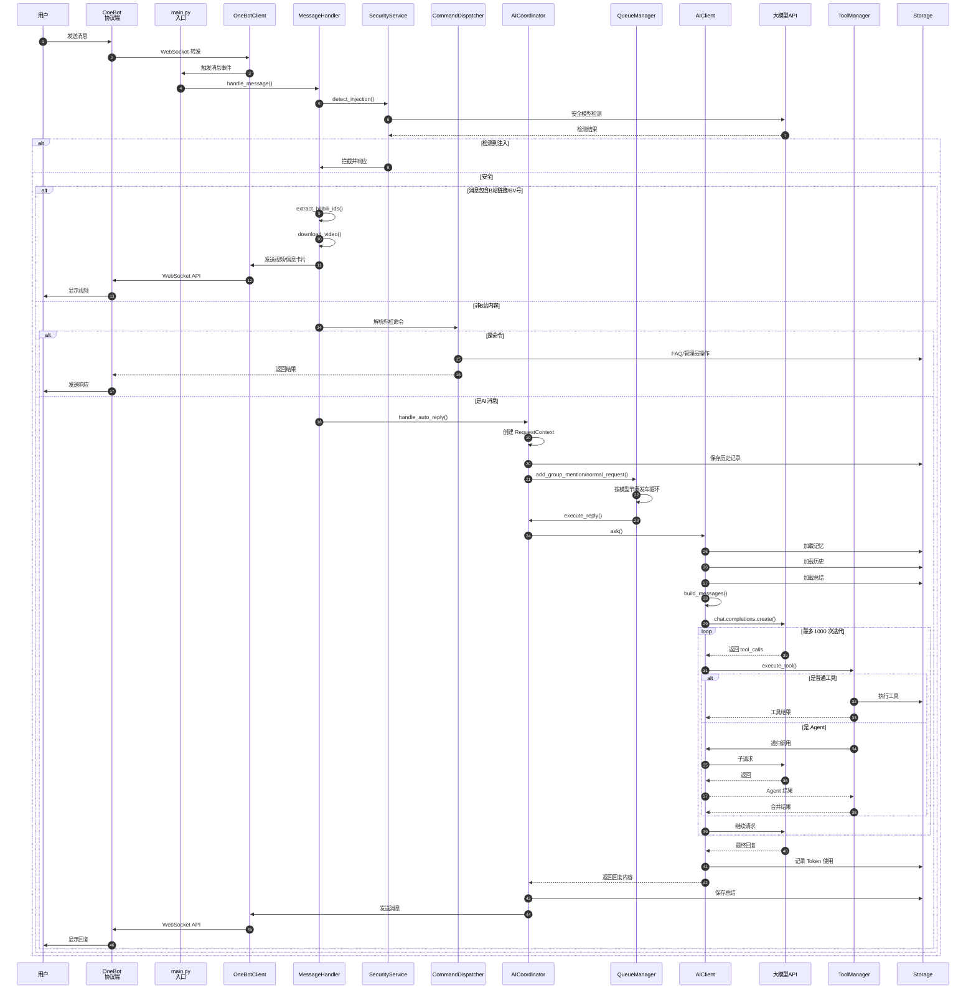
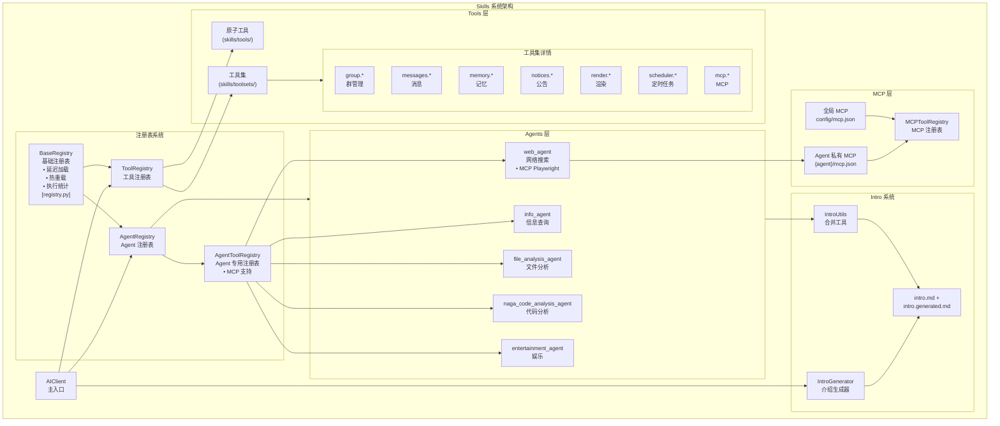
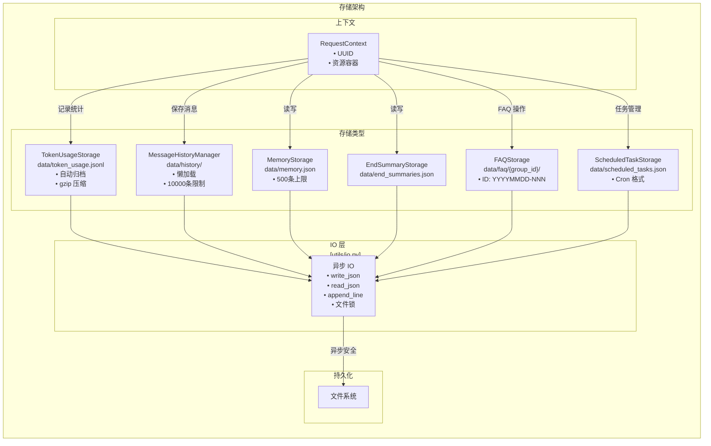
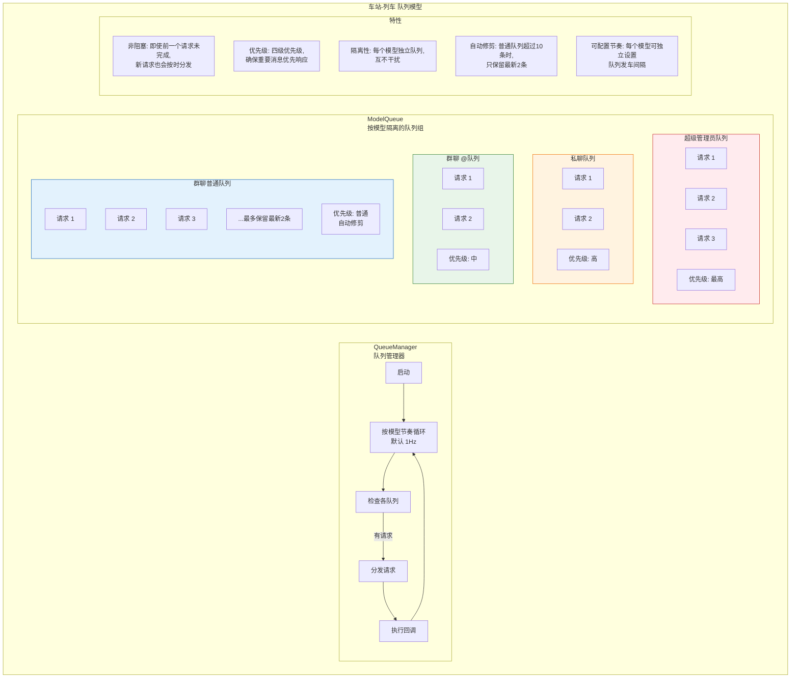
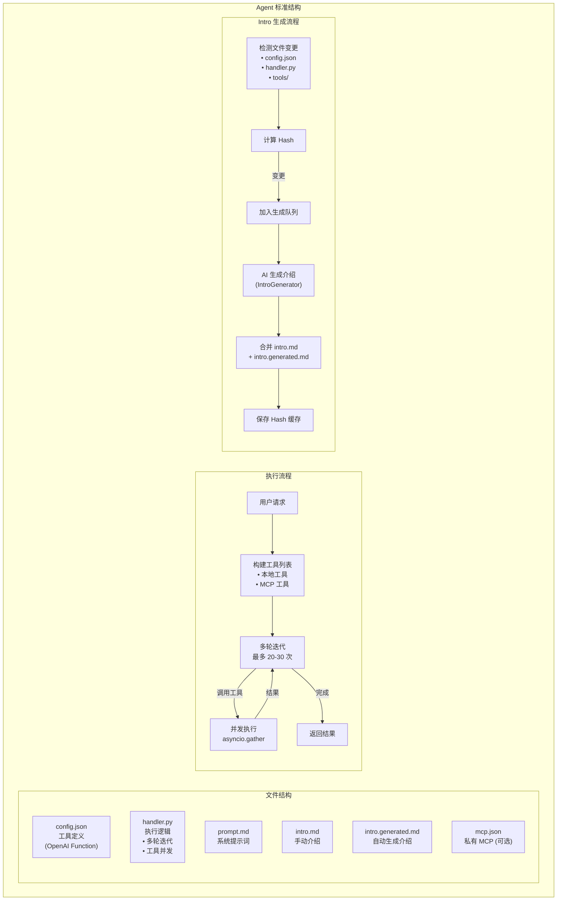
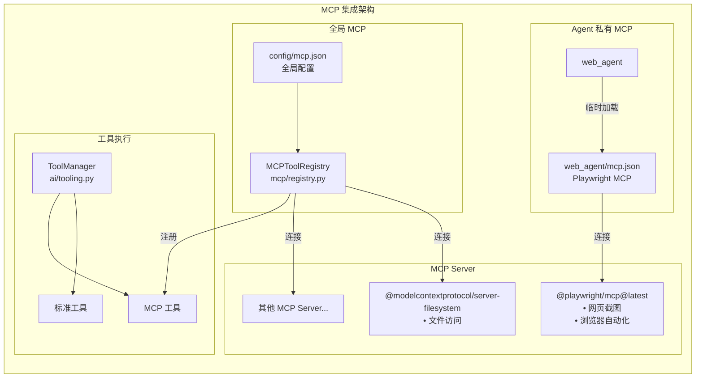
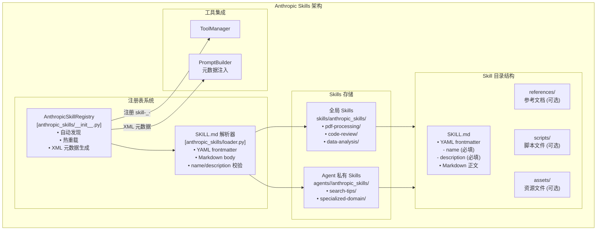

# Undefined 详细架构图

## 一、完整系统架构图

```mermaid
graph TB
    %% ==================== 外部实体 ====================
    subgraph External["外部实体层"]
        User([用户 User])
        Admin([管理员 Admin])
        OneBotServer["OneBot 协议端<br/>(NapCat / Lagrange.Core)"]
        LLM_API["大模型 API 服务商<br/>(OpenAI / Claude / DeepSeek / etc.)"]
    end

    %% ==================== 核心入口层 ====================
    subgraph EntryPoint["核心入口层 (src/Undefined/)"]
        Main["main.py<br/>启动入口"]
        ConfigLoader["ConfigManager<br/>配置管理器<br/>[config/manager.py + loader.py]"]
        ConfigHotReload["ConfigHotReload<br/>热更新应用器<br/>[config/hot_reload.py]"]
        ConfigModels["配置模型<br/>[config/models.py]<br/>ChatModelConfig<br/>VisionModelConfig<br/>SecurityModelConfig<br/>AgentModelConfig"]
        OneBotClient["OneBotClient<br/>WebSocket 客户端<br/>[onebot.py]"]
        Context["RequestContext<br/>请求上下文<br/>[context.py]"]
        WebUI["webui.py<br/>配置控制台<br/>[src/Undefined/webui.py]"]
    end

    %% ==================== 消息处理层 ====================
    subgraph MessageLayer["消息处理层 (src/Undefined/)"]
        MessageHandler["MessageHandler<br/>消息处理器<br/>[handlers.py]"]

        subgraph BilibiliModule["Bilibili 模块 (bilibili/)"]
            BilibiliParser["parser.py<br/>标识符解析<br/>• BV/AV号 • URL<br/>• b23.tv短链 • 小程序JSON"]
            BilibiliDownloader["downloader.py<br/>视频下载<br/>• DASH流 • ffmpeg合并"]
            BilibiliSender["sender.py<br/>视频发送<br/>• 视频消息 • 降级信息卡片"]
        end

        subgraph SecurityLayer["安全防线 (services/)"]
            SecurityService["SecurityService<br/>安全服务<br/>• 注入攻击检测<br/>• 速率限制<br/>[security.py]"]
            InjectionAgent["InjectionResponseAgent<br/>注入响应生成<br/>[injection_response_agent.py]"]
        end
        
        CommandDispatcher["CommandDispatcher<br/>命令分发器<br/>• /help /stats /lsadmin<br/>• /addadmin /rmadmin<br/>• /bugfix /lsfaq<br/>[services/command.py]"]
        
        subgraph QueueSystem["车站-列车 队列系统 (services/)"]
            AICoordinator["AICoordinator<br/>AI 协调器<br/>• Prompt 构建<br/>• 队列管理<br/>• 回复执行<br/>[ai_coordinator.py]"]
            QueueManager["QueueManager<br/>队列管理器<br/>[queue_manager.py]"]
            
            subgraph ModelQueues["ModelQueue 队列组 (按模型隔离)"]
                Q_SuperAdmin["超级管理员队列<br/>优先级: 最高"]
                Q_Private["私聊队列<br/>优先级: 高"]
                Q_Mention["群聊 @队列<br/>优先级: 中"]
                Q_Normal["群聊普通队列<br/>优先级: 普通<br/>自动修剪: 保留最新2条"]
            end
            
            DispatcherLoop[("按模型节奏<br/>发车循环<br/>默认 1Hz")]
        end
    end

    %% ==================== AI 核心能力层 ====================
    subgraph AILayer["AI 核心能力层 (src/Undefined/ai/)"]
        AIClient["AIClient<br/>AI 客户端主入口<br/>[client.py]<br/>• 技能热重载 • MCP 初始化<br/>• Agent intro 生成"]
        
        subgraph AIComponents["AI 组件"]
            PromptBuilder["PromptBuilder<br/>提示词构建器<br/>[prompts.py]"]
            ModelRequester["ModelRequester<br/>模型请求器<br/>[llm.py]<br/>• OpenAI SDK • 工具清理<br/>• Thinking 提取"]
            ToolManager["ToolManager<br/>工具管理器<br/>[tooling.py]<br/>• 工具执行 • Agent 工具合并<br/>• MCP 工具注入"]
            MultimodalAnalyzer["MultimodalAnalyzer<br/>多模态分析器<br/>[multimodal.py]<br/>• 图片/音频/视频"]
            SummaryService["SummaryService<br/>总结服务<br/>[summaries.py]<br/>• 聊天记录总结<br/>• 标题生成"]
            TokenCounter["TokenCounter<br/>Token 统计<br/>[tokens.py]"]
            Parsing["Parsing<br/>响应解析<br/>[parsing.py]"]
        end
    end

    %% ==================== 技能系统层 ====================
    subgraph SkillsLayer["Skills 技能系统 (src/Undefined/skills/)"]
        subgraph RegistryLayer["注册表核心"]
            ToolRegistry["ToolRegistry<br/>工具注册表<br/>[registry.py]<br/>• 延迟加载 • 热重载支持<br/>• 执行统计"]
            AgentRegistry["AgentRegistry<br/>Agent 注册表<br/>[registry.py]<br/>• Agent 发现 • 工具聚合"]
            AgentToolRegistry["AgentToolRegistry<br/>Agent 专用工具注册表<br/>[agents/agent_tool_registry.py]<br/>• MCP 支持"]
            IntroGenerator["IntroGenerator<br/>Agent 介绍生成器<br/>[agents/intro_generator.py]<br/>• 自动 hash 检测<br/>• intro.generated.md"]
            AnthropicSkillRegistry["AnthropicSkillRegistry<br/>Anthropic Skills 注册表<br/>[anthropic_skills/]<br/>• SKILL.md 解析<br/>• 渐进式披露"]
        end
        
        subgraph AtomicTools["基础工具 (skills/tools/)"]
            T_End["end<br/>结束对话"]
            T_Python["python_interpreter<br/>Python 解释器"]
            T_Time["get_current_time<br/>获取当前时间"]
            T_GetPicture["get_picture<br/>获取图片"]
            T_GetUserInfo["get_user_info<br/>获取用户信息"]
            T_BilibiliVideo["bilibili_video<br/>B站视频下载发送"]
        end
        
        subgraph Toolsets["工具集 (skills/toolsets/)"]
            TS_Group["group.*<br/>• get_member_list<br/>• get_member_info<br/>• get_honor_info<br/>• get_files"]
            TS_Messages["messages.*<br/>• send_message<br/>• get_recent_messages<br/>• get_forward_msg"]
            TS_Memory["memory.*<br/>• add / delete<br/>• list / update"]
            TS_Notices["notices.*<br/>• list / get / stats"]
            TS_Render["render.*<br/>• render_html<br/>• render_latex<br/>• render_markdown"]
            TS_Scheduler["scheduler.*<br/>• create_schedule_task<br/>• delete_schedule_task<br/>• list_schedule_tasks"]
            TS_MCP["mcp.*<br/>MCP 工具集"]
        end
        
        subgraph IntelligentAgents["智能体 Agents (skills/agents/)"]
            A_Info["info_agent<br/>信息查询助手<br/>(17个工具)<br/>• weather_query<br/>• *hot 热搜<br/>• bilibili_*<br/>• whois"]
            A_Web["web_agent<br/>网络搜索助手<br/>(3个工具 + MCP)<br/>• web_search<br/>• crawl_webpage<br/>• Playwright MCP"]
            A_File["file_analysis_agent<br/>文件分析助手<br/>(14个工具)<br/>• extract_* (PDF/Word/Excel/PPT)<br/>• analyze_code<br/>• analyze_multimodal"]
            A_Naga["naga_code_analysis_agent<br/>NagaAgent 代码分析<br/>(7个工具)<br/>• read_file / glob<br/>• search_file_content"]
            A_Entertainment["entertainment_agent<br/>娱乐助手<br/>(9个工具)<br/>• ai_draw_one<br/>• horoscope<br/>• video_random_recommend"]
        end
        
        subgraph MCPIntegration["MCP 集成 (src/Undefined/mcp/)"]
            MCPRegistry["MCPToolRegistry<br/>MCP 工具注册表<br/>[registry.py]<br/>• 连接 MCP Server<br/>• 工具转换"]
            MCP_Config["MCP 配置<br/>config/mcp.json<br/>(全局配置)"]
            MCP_Agent_Private["Agent 私有 MCP<br/>mcp.json<br/>(按 Agent)"]
        end
        
        subgraph AnthropicSkills["Anthropic Skills (skills/anthropic_skills/)"]
            AS_Registry["AnthropicSkillRegistry<br/>Skills 注册表<br/>[anthropic_skills/__init__.py]<br/>• 自动发现 • 热重载"]
            AS_Loader["SKILL.md 解析器<br/>[anthropic_skills/loader.py]<br/>• YAML frontmatter<br/>• Markdown body"]
            AS_Global["全局 Skills<br/>skills/anthropic_skills/<br/>• pdf-processing<br/>• code-review"]
            AS_Agent["Agent 私有 Skills<br/>agents/<name>/anthropic_skills/"]
        end
    end

    %% ==================== 存储与上下文层 ====================
    subgraph StorageLayer["存储与上下文层 (src/Undefined/)"]
        subgraph ContextLayer["上下文管理"]
            RequestContext["RequestContext<br/>[context.py]<br/>• UUID 追踪<br/>• 资源容器<br/>• 自动传播"]
            ContextFilter["RequestContextFilter<br/>日志过滤器<br/>• request_id<br/>• group_id / user_id"]
            ResourceRegistry["ContextResourceRegistry<br/>资源注册表<br/>[context_resource_registry.py]<br/>• 动态扫描"]
        end
        
        subgraph StorageComponents["存储组件"]
            HistoryManager["MessageHistoryManager<br/>消息历史管理<br/>[utils/history.py]<br/>• 懒加载<br/>• 10000条限制"]
            MemoryStorage["MemoryStorage<br/>长期记忆存储<br/>[memory.py]<br/>• 500条上限<br/>• 自动去重"]
            EndSummaryStorage["EndSummaryStorage<br/>短期总结存储<br/>[end_summary_storage.py]"]
            FAQStorage["FAQStorage<br/>FAQ 存储<br/>[faq.py]<br/>• data/faq/{group_id}/"]
            ScheduledTaskStorage["ScheduledTaskStorage<br/>定时任务存储<br/>[scheduled_task_storage.py]"]
            TokenUsageStorage["TokenUsageStorage<br/>Token 使用统计<br/>[token_usage_storage.py]<br/>• 自动归档<br/>• gzip 压缩"]
        end
        
        subgraph IOLayer["异步 IO 层 (src/Undefined/utils/)"]
            IOUtils["IO 工具<br/>[io.py]<br/>• write_json<br/>• read_json<br/>• append_line<br/>• 文件锁 (flock/msvcrt) + 原子写入"]
            SchedulerUtils["调度器工具<br/>[scheduler.py]<br/>• crontab 解析"]
            CacheUtils["缓存工具<br/>[cache.py]<br/>• 定期清理"]
            SenderUtils["Sender 工具<br/>[sender.py]"]
        end
    end

    %% ==================== 数据持久化层 ====================
    subgraph Persistence["数据持久化层 (data/)"]
        Dir_History["history/<br/>• group_{id}.json<br/>• private_{id}.json"]
        Dir_FAQ["faq/<br/>• {group_id}/<br/>  - {date}-{seq}.json"]
        Dir_TokenUsage["token_usage_archives/<br/>• token_usage.jsonl<br/>• *.jsonl.gz"]
        File_Memory["memory.json<br/>(长期记忆)"]
        File_EndSummary["end_summaries.json<br/>(短期总结)"]
        File_ScheduledTasks["scheduled_tasks.json<br/>(定时任务)"]
        Dir_Logs["logs/<br/>• bot.log<br/>• 轮转日志"]
        File_Config["config.toml<br/>config.local.json"]
    end

    %% ==================== 资源文件层 ====================
    subgraph Resources["资源文件层 (res/)"]
        Prompts["prompts/<br/>• undefined.xml<br/>• agent_self_intro.txt<br/>• analyze_multimodal.txt"]
        Intros["agents/intro/<br/>• intro.md<br/>• intro.generated.md"]
    end

    %% ==================== 连接线 ====================
    %% 外部实体到核心入口
    User -->|"消息"| OneBotServer
    Admin -->|"指令"| OneBotServer
    OneBotServer <-->|"WebSocket<br/>Event / API"| OneBotClient
    
    %% 核心入口层内部
    Main -->|"初始化"| ConfigLoader
    Main -->|"订阅变更"| ConfigHotReload
    Main -->|"创建"| OneBotClient
    Main -->|"创建"| AIClient
    ConfigLoader --> ConfigModels
    ConfigLoader -->|"读取"| File_Config
    ConfigLoader -->|"变更回调"| ConfigHotReload
    ConfigHotReload -->|"热更新"| AIClient
    ConfigHotReload -->|"热更新"| QueueManager
    WebUI -->|"读写"| File_Config
    OneBotClient -->|"消息事件"| MessageHandler
    
    %% 消息处理层
    MessageHandler -->|"1. 安全检测"| SecurityService
    SecurityService -.->|"API 调用"| LLM_API
    SecurityService -->|"注入攻击"| InjectionAgent

    MessageHandler -->|"1.5 Bilibili检测"| BilibiliParser
    BilibiliParser -->|"BV号"| BilibiliDownloader
    BilibiliDownloader -->|"视频文件"| BilibiliSender
    BilibiliSender -->|"发送"| OneBotClient

    MessageHandler -->|"2. 指令?"| CommandDispatcher
    CommandDispatcher -->|"执行结果"| OneBotClient
    
    MessageHandler -->|"3. 自动回复"| AICoordinator
    AICoordinator -->|"创建上下文"| RequestContext
    AICoordinator -->|"入队"| QueueManager
    QueueManager -->|"分发"| ModelQueues
    ModelQueues -->|"轮询取值"| DispatcherLoop
    DispatcherLoop -->|"异步执行"| AIClient
    
    %% AI 核心能力层
    AIClient --> PromptBuilder
    AIClient --> ModelRequester
    AIClient --> ToolManager
    AIClient --> MultimodalAnalyzer
    AIClient --> SummaryService
    AIClient --> TokenCounter
    
    ModelRequester <-->|"API 请求"| LLM_API
    PromptBuilder -->|"注入记忆"| MemoryStorage
    PromptBuilder -->|"注入总结"| EndSummaryStorage
    PromptBuilder -->|"注入历史"| HistoryManager
    
    ToolManager -->|"获取工具"| ToolRegistry
    ToolManager -->|"获取 Agent"| AgentRegistry
    ToolManager -->|"获取 MCP"| MCPRegistry
    
    %% 技能系统层
    ToolRegistry --> AtomicTools
    ToolRegistry --> Toolsets
    AgentRegistry --> IntelligentAgents
    AgentRegistry -->|"触发"| IntroGenerator
    
    A_Web -->|"私有 MCP"| MCP_Agent_Private
    MCP_Agent_Private -->|"连接"| MCPRegistry
    MCP_Config -->|"全局 MCP"| MCPRegistry
    
    %% 存储层
    RequestContext -->|"日志增强"| ContextFilter
    RequestContext -->|"资源扫描"| ResourceRegistry
    
    MessageHandler -->|"保存消息"| HistoryManager
    AICoordinator -->|"记录统计"| TokenUsageStorage
    CommandDispatcher -->|"FAQ 操作"| FAQStorage
    
    %% IO 层到持久化
    HistoryManager -->|"异步读写"| IOUtils
    MemoryStorage -->|"异步读写"| IOUtils
    TokenUsageStorage -->|"异步读写<br/>自动归档"| IOUtils
    FAQStorage -->|"异步读写"| IOUtils
    ScheduledTaskStorage -->|"异步读写"| IOUtils
    
    IOUtils --> Dir_History
    IOUtils --> File_Memory
    IOUtils --> File_EndSummary
    IOUtils --> Dir_TokenUsage
    IOUtils --> Dir_FAQ
    IOUtils --> File_ScheduledTasks
    
    %% 资源文件
    PromptBuilder -->|"加载"| Prompts
    IntroGenerator -->|"生成"| Intros
    IntelligentAgents -->|"读取"| Intros
    
    %% Agent 递归调用
    IntelligentAgents -->|"递归调用"| AIClient
    
    %% 样式定义
    classDef external fill:#ffebee,stroke:#c62828,stroke-width:2px
    classDef core fill:#e3f2fd,stroke:#1565c0,stroke-width:2px
    classDef message fill:#fff3e0,stroke:#ef6c00,stroke-width:2px
    classDef ai fill:#f3e5f5,stroke:#6a1b9a,stroke-width:2px
    classDef skills fill:#e8f5e9,stroke:#2e7d32,stroke-width:2px
    classDef storage fill:#e0f7fa,stroke:#00838f,stroke-width:2px
    classDef io fill:#fce4ec,stroke:#c2185b,stroke-width:1px
    classDef persistence fill:#f5f5f5,stroke:#616161,stroke-width:1px
    classDef resource fill:#fff8e1,stroke:#ff8f00,stroke-width:1px
    classDef queue fill:#e8eaf6,stroke:#3949ab,stroke-width:2px
    classDef agent fill:#e1f5fe,stroke:#0277bd,stroke-width:2px
    
    class User,Admin,OneBotServer,LLM_API external
    class Main,ConfigLoader,ConfigHotReload,ConfigModels,OneBotClient,Context,WebUI core
    class MessageHandler,SecurityService,InjectionAgent,CommandDispatcher,AICoordinator message
    class AIClient,PromptBuilder,ModelRequester,ToolManager,MultimodalAnalyzer,SummaryService,TokenCounter,Parsing ai
    class ToolRegistry,AgentRegistry,AgentToolRegistry,IntroGenerator skills
    class RequestContext,ContextFilter,ResourceRegistry,HistoryManager,MemoryStorage,EndSummaryStorage,FAQStorage,ScheduledTaskStorage,TokenUsageStorage storage
    class IOUtils,SchedulerUtils,CacheUtils,SenderUtils io
    class Dir_History,Dir_FAQ,Dir_TokenUsage,File_Memory,File_EndSummary,File_ScheduledTasks,Dir_Logs,File_Config persistence
    class Prompts,Intros resource
    class QueueManager,ModelQueues,DispatcherLoop queue
    class A_Info,A_Web,A_File,A_Naga,A_Entertainment agent
```



## 二、数据流向图



## 三、Skills 系统架构图



## 四、存储架构图



## 五、队列模型详解



## 六、Agent 结构详解



## 七、MCP 集成架构



## 八、Anthropic Skills 架构



### Anthropic Skills 规范

遵循 [agentskills.io](https://agentskills.io) 开放标准，参照 Claude Code 实现。

**SKILL.md 格式：**

```yaml
---
name: pdf-processing
description: 从 PDF 文件中提取文本和表格，填写表单。当用户提到 PDF 时使用。
---

# PDF 处理指南

## 文本提取

使用 pdfplumber...

## 表格提取

...
```

**核心特性：**

- **渐进式披露**：元数据（name + description）始终注入 system prompt（Level 1），完整内容按需调用获取（Level 2）
- **自动发现**：扫描目录下所有包含 `SKILL.md` 的子目录
- **工具注册**：每个 skill 注册为 `skills-_-<name>` function tool
- **热重载**：监视 `SKILL.md` 变更，自动重新加载
- **Agent 私有**：支持在 `agents/<name>/anthropic_skills/` 下存放 agent 专属 skills

## 九、核心配置一览

| 配置类别 | 关键配置项 | 说明 |
|---------|-----------|------|
| **基础配置** | `core.bot_qq`, `core.superadmin_qq`, `onebot.ws_url` | 机器人身份和连接 |
| **模型配置** | `models.chat` / `models.vision` / `models.agent` / `models.security` | 四类模型独立配置（含 `queue_interval_seconds`） |
| **功能开关** | `skills.hot_reload`, `skills.intro_autogen_enabled` | 热重载和自动生成 |
| **日志配置** | `logging.level`, `logging.file_path`, `logging.max_size_mb` | 日志系统 |
| **MCP 配置** | `mcp.config_path` | MCP 配置文件路径 |
| **存储配置** | `token_usage.*` | Token 归档和清理策略 |
| **Bilibili** | `bilibili.auto_extract_enabled`, `bilibili.cookie`, `bilibili.prefer_quality` | B站视频自动提取与下载 |
| **思考链** | `*.thinking_enabled` | 思维链支持 |
| **思维链兼容** | `*.thinking_tool_call_compat` | 思维链 + 工具调用兼容 |
| **WebUI** | `webui.url`, `webui.port`, `webui.password` | 配置控制台 |

## 十、架构详解

### 8层架构分层

1. **外部实体层**：用户、管理员、OneBot 协议端 (NapCat/Lagrange.Core)、大模型 API 服务商
2. **核心入口层**：main.py 启动入口、配置管理器 (config/loader.py)、热更新应用器 (config/hot_reload.py)、OneBotClient (onebot.py)、RequestContext (context.py)
3. **消息处理层**：MessageHandler (handlers.py)、SecurityService (security.py)、CommandDispatcher (services/command.py)、AICoordinator (ai_coordinator.py)、QueueManager (queue_manager.py)、Bilibili 自动提取 (bilibili/)
4. **AI 核心能力层**：AIClient (client.py)、PromptBuilder (prompts.py)、ModelRequester (llm.py)、ToolManager (tooling.py)、MultimodalAnalyzer (multimodal.py)、SummaryService (summaries.py)、TokenCounter (tokens.py)
5. **存储与上下文层**：MessageHistoryManager (utils/history.py, 10000条限制)、MemoryStorage (memory.py, 500条上限)、EndSummaryStorage、FAQStorage、ScheduledTaskStorage、TokenUsageStorage (自动归档)
6. **技能系统层**：ToolRegistry (registry.py)、AgentRegistry、6个 Agents (共64个工具)、7类 Toolsets
7. **异步 IO 层**：统一 IO 工具 (utils/io.py)，包含 write_json、read_json、append_line、跨平台文件锁 (flock/msvcrt)
8. **数据持久化层**：历史数据目录、FAQ 目录、Token 归档目录、记忆文件、总结文件、定时任务文件

### "车站-列车" 队列模型

针对高并发消息处理，Undefined 实现了全新的 **ModelQueue** 调度机制：

*   **多模型隔离**：每个 AI 模型拥有独立的请求队列组（"站台"），互不干扰。
*   **非阻塞发车**：实现了可配置节奏的非阻塞调度循环（默认 **1Hz**）。列车按节奏出发，带走一个请求到后台异步处理。
*   **高可用性**：即使前一个请求仍在处理（如耗时的网络搜索），新的请求也会按时被分发，不会造成队列堵塞。
*   **优先级管理**：支持四级优先级（超级管理员 > 私聊 > 群聊@ > 群聊普通），确保重要消息优先响应。

### 5个智能体 Agent

| Agent | 功能定位 | 工具数量 | 核心能力 |
|-------|---------|---------|---------|
| **info_agent** | 信息查询助手 | 17个 | 天气查询、热搜榜单、网络检测、B站信息查询等 |
| **web_agent** | 网络搜索助手 | 3个 + MCP | 网页搜索、爬虫、Playwright MCP |
| **file_analysis_agent** | 文件分析助手 | 14个 | PDF/Word/Excel/PPT解析、代码分析、多模态分析 |
| **naga_code_analysis_agent** | NagaAgent 代码分析 | 7个 | 代码库浏览、文件搜索、目录遍历 |
| **entertainment_agent** | 娱乐助手 | 9个 | AI 绘图、星座运势、小说搜索、随机视频推荐等 |

### Skills 插件系统

- **Tools (基础工具)**：原子化的功能单元，如 `send_message`, `get_history`, `bilibili_video`。
- **Toolsets (复合工具集)**：7大类工具集 (group, messages, memory, notices, render, scheduler, mcp)。
- **延迟加载 + 热重载**：`handler.py` 仅在首次调用时导入；当 `skills/` 下的 `config.json`/`handler.py` 发生变更时会自动重新加载。
- **Agent 自我介绍自动生成**：启动时按 Agent 代码/配置 hash 生成 `intro.generated.md` 并与 `intro.md` 合并。

### 统一 IO 层与异步存储

-   **统一 IO 工具** (`src/Undefined/utils/io.py`)：任何涉及磁盘读写的操作（JSON 读写、行追加）都必须通过该层，内部使用 `asyncio.to_thread` 将阻塞调用移出主线程。
-   **内核级文件锁**：引入跨平台文件锁 (Linux/macOS 使用 `flock`，Windows 使用 `msvcrt`)；通过锁文件实现跨平台一致的互斥语义。
-   **原子写入**：关键 JSON 写入使用“写临时文件 + `os.replace` 原子替换”，避免进程异常退出导致文件半写损坏。
-   **存储组件异步化**：所有核心存储类（Memory, FAQ, Tasks）现已全面提供异步接口，确保机器人响应不受磁盘延迟影响。

### 资源加载与提示词安全

-   **资源加载**：提示词与预置文案通过 `src/Undefined/utils/resources.py` 读取，优先从运行目录加载同名 `res/...`（便于覆盖），若不存在再回退到安装包自带资源，并提供仓库结构兜底，避免依赖启动时的工作目录。
-   **提示词结构安全**：结构化 Prompt/历史消息注入使用 `src/Undefined/utils/xml.py` 做必要的 XML 转义，降低用户输入破坏结构或干扰解析的风险。

---

**架构图版本**: v2.14.0
**更新日期**: 2026-02-13  
**基于代码版本**: 最新 main 分支
