<table border="0">
  <tr>
    <td width="70%" valign="top">
      <div align="center">
        <h1>Undefined</h1>
        <em>A high-performance, highly scalable QQ group and private chat robot based on a self-developed architecture.</em>
        <br/><br/>
        <a href="https://www.python.org/"></a>
        <a href="https://docs.astral.sh/uv/"></a>
        <a href="LICENSE"></a>
        <a href="https://deepwiki.com/69gg/Undefined"></a>
        <br/><br/>
        <p>大鹏一日同风起，扶摇直上九万里。</p>
      </div>
      <h3>项目简介</h3>
      <p>
        <strong>Undefined</strong> 是一个功能强大的 QQ 机器人平台，采用全新的 <strong>自研 Skills</strong> 架构。基于现代 Python 异步技术栈构建，它不仅提供基础的对话能力，更通过内置的多个智能 Agent 实现代码分析、网络搜索、娱乐互动等多模态能力。
      </p>
    </td>
    <td width="30%">
      
    </td>
  </tr>
</table>

### _与 [NagaAgent](https://github.com/Xxiii8322766509/NagaAgent) 进行联动！_

---

<details>
<summary><b>目录</b></summary>

- [立即体验](#立即体验)
- [核心特性](#核心特性)
- [系统架构概览](#系统架构概览)
  - [架构图（Mermaid）](#架构图mermaid)
  - [延伸阅读](#延伸阅读)
- [安装与部署](#安装与部署)
  - [pip/uv tool 部署（推荐用于直接使用）](#pipuv-tool-部署推荐用于直接使用)
    - [完整日志（排查用）](#完整日志排查用)
    - [pip/uv tool 部署的自定义方式](#pipuv-tool-部署的自定义方式)
  - [源码部署（开发/使用）](#源码部署开发使用)
    - [1. 克隆项目](#1-克隆项目)
    - [2. 安装依赖](#2-安装依赖)
    - [3. 配置环境](#3-配置环境)
    - [源码部署的自定义指南](#源码部署的自定义指南)
    - [4. 启动运行](#4-启动运行)
    - [5. 跨平台与资源路径（重要）](#5-跨平台与资源路径重要)
  - [配置说明](#配置说明)
    - [配置热更新说明](#配置热更新说明)
    - [会话白名单示例](#会话白名单示例)
  - [MCP 配置](#mcp-配置)
    - [Agent 私有 MCP（可选）](#agent-私有-mcp可选)
- [使用说明](#使用说明)
  - [开始使用](#开始使用)
  - [Agent 能力展示](#agent-能力展示)
  - [管理员命令](#管理员命令)
- [扩展与开发](#扩展与开发)
  - [目录结构](#目录结构)
  - [开发指南](#开发指南)
  - [开发自检](#开发自检)
- [文档与延伸阅读](#文档与延伸阅读)
- [风险提示与免责声明](#风险提示与免责声明)
- [致谢与友链](#致谢与友链)
  - [NagaAgent](#nagaagent)
- [开源协议](#开源协议)

</details>

---

## 立即体验

[点击添加官方实例QQ](https://qm.qq.com/q/cvjJoNysGA)

## 核心特性

- **Skills 架构**：全新设计的技能系统，将基础工具（Tools）与智能代理（Agents）分层管理，支持自动发现与注册。
- **Skills 热重载**：自动扫描 `skills/` 目录，检测到变更后即时重载工具与 Agent，无需重启服务。
- **配置热更新 + WebUI**：使用 `config.toml` 配置，支持热更新；提供 WebUI 在线编辑与校验。
- **会话白名单（群/私聊）**：只需配置 `access.allowed_group_ids` / `access.allowed_private_ids` 两个列表，即可把机器人“锁”在指定群与指定私聊里；避免被拉进陌生群误触发、也避免工具/定时任务把消息误发到不该去的地方（默认留空不限制）。
- **并发防重复执行（进行中摘要）**：对私聊与 `@机器人` 场景在首轮前预占位，并在后续请求注入 `【进行中的任务】` 上下文，减少"催促/追问"导致的重复任务执行；支持通过 `features.inflight_pre_register_enabled`（预注册占位，默认启用）和 `features.inflight_summary_enabled`（摘要生成，默认禁用）独立控制。
- **并行工具执行**：无论是主 AI 还是子 Agent，均支持 `asyncio` 并发工具调用，大幅提升多任务处理速度（如同时读取多个文件或搜索多个关键词）。
- **智能 Agent 矩阵**：内置多个专业 Agent，分工协作处理复杂任务。
- **Agent 互调用**：Agent 之间可以相互调用，通过简单的配置文件（`callable.json`）即可让某个 Agent 成为其他 Agent 的工具，支持细粒度的访问控制，实现复杂的多 Agent 协作场景。
- **Agent 自我介绍自动生成**：启动时按 Agent 代码/配置 hash 生成 `intro.generated.md`（第一人称、结构化），与 `intro.md` 合并后作为描述；减少手动维护，保持能力说明与实现同步，有助于精准调度。
- **请求上下文管理**：基于 Python `contextvars` 的统一请求上下文系统，自动 UUID 追踪，零竞态条件，完全的并发隔离。
- **定时任务系统**：支持 Crontab 语法的强大定时任务系统，可自动执行各种操作（如定时提醒、定时搜索）。
- **MCP 协议支持**：支持通过 MCP (Model Context Protocol) 连接外部工具和数据源，扩展 AI 能力。
- **Agent 私有 MCP**：可为单个 agent 提供独立 MCP 配置，按调用即时加载并释放，工具仅对该 agent 可见。
- **Anthropic Skills**：支持 Anthropic Agent Skills（SKILL.md 格式），遵循 agentskills.io 开放标准，提供领域知识注入能力。
- **Bilibili 视频提取**：自动检测消息中的 B 站视频链接/BV 号/小程序分享，下载 1080p 视频并通过 QQ 发送；同时提供 AI 工具调用入口。
- **思维链支持**：支持开启思维链，提升复杂逻辑推理能力。
- **高并发架构**：基于 `asyncio` 全异步设计，支持多队列消息处理与工具并发执行，轻松应对高并发场景。
- **异步安全 I/O**：统一 IO 层通过线程池 + 跨平台文件锁（Linux/macOS `flock`，Windows `msvcrt`）+ 原子写入（`os.replace`）保证并发写入不损坏、且不阻塞主事件循环。
- **安全防护**：内置独立的安全模型，实时检测注入攻击与恶意内容。
- **OneBot 协议**：完美兼容 OneBot V11 协议，支持多种前端实现（如 NapCat）。

## 系统架构概览

Undefined 采用 **8层异步架构设计**，以下是详细的系统架构图（包含所有核心组件、6个Agent、7类工具集、存储系统与数据流）：

### 架构图（Mermaid）

```mermaid
graph TB
    %% ==================== 外部实体层 ====================
    User([用户 User])
    Admin([管理员 Admin])
    OneBotServer["OneBot 协议端<br/>(NapCat / Lagrange.Core)"]
    LLM_API["大模型 API 服务商<br/>(OpenAI / Claude / DeepSeek / etc.)"]

    %% ==================== 核心入口层 ====================
    subgraph EntryPoint["核心入口层 (src/Undefined/)"]
        Main["main.py<br/>启动入口"]
        ConfigLoader["ConfigManager<br/>配置管理器<br/>[config/manager.py + loader.py]"]
        ConfigModels["配置模型<br/>[config/models.py]<br/>ChatModelConfig<br/>VisionModelConfig<br/>SecurityModelConfig<br/>AgentModelConfig"]
        OneBotClient["OneBotClient<br/>WebSocket 客户端<br/>[onebot.py]"]
        Context["RequestContext<br/>请求上下文<br/>[context.py]"]
        WebUI["webui.py<br/>配置控制台<br/>[src/Undefined/webui.py]"]
    end

    %% ==================== 消息处理层 ====================
    subgraph MessageLayer["消息处理层"]
        MessageHandler["MessageHandler<br/>消息处理器<br/>[handlers.py]"]
        SecurityService["SecurityService<br/>安全服务<br/>• 注入检测 • 速率限制<br/>[security.py]"]
        CommandDispatcher["CommandDispatcher<br/>命令分发器<br/>• /help /stats /lsadmin<br/>• /addadmin /rmadmin<br/>[services/command.py]"]
        AICoordinator["AICoordinator<br/>AI 协调器<br/>• Prompt 构建 • 队列管理<br/>• 回复执行<br/>[ai_coordinator.py]"]
        QueueManager["QueueManager<br/>队列管理器<br/>[queue_manager.py]"]
    end

    %% ==================== AI 核心能力层 ====================
    subgraph AILayer["AI 核心能力层 (src/Undefined/ai/)"]
        AIClient["AIClient<br/>AI 客户端主入口<br/>[client.py]<br/>• 技能热重载 • MCP 初始化<br/>• Agent 介绍生成"]
        PromptBuilder["PromptBuilder<br/>提示词构建器<br/>[prompts.py]"]
        ModelRequester["ModelRequester<br/>模型请求器<br/>[llm.py]<br/>• OpenAI SDK • 工具清理<br/>• Thinking 提取"]
        ToolManager["ToolManager<br/>工具管理器<br/>[tooling.py]<br/>• 工具执行 • Agent 工具合并<br/>• MCP 工具注入"]
        MultimodalAnalyzer["MultimodalAnalyzer<br/>多模态分析器<br/>[multimodal.py]"]
        SummaryService["SummaryService<br/>总结服务<br/>[summaries.py]"]
        TokenCounter["TokenCounter<br/>Token 统计<br/>[tokens.py]"]
    end

    %% ==================== 存储与上下文层 ====================
    subgraph StorageLayer["存储与上下文层"]
        HistoryManager["MessageHistoryManager<br/>消息历史管理<br/>[utils/history.py]<br/>• 懒加载 • 10000条限制"]
        MemoryStorage["MemoryStorage<br/>长期记忆存储<br/>[memory.py]<br/>• 500条上限 • 自动去重"]
        EndSummaryStorage["EndSummaryStorage<br/>短期总结存储<br/>[end_summary_storage.py]"]
        FAQStorage["FAQStorage<br/>FAQ 存储<br/>[faq.py]"]
        ScheduledTaskStorage["ScheduledTaskStorage<br/>定时任务存储<br/>[scheduled_task_storage.py]"]
        TokenUsageStorage["TokenUsageStorage<br/>Token 使用统计<br/>[token_usage_storage.py]<br/>• 自动归档 • gzip 压缩"]
    end

    %% ==================== 技能系统层 ====================
    subgraph SkillsLayer["Skills 技能系统 (src/Undefined/skills/)"]
        ToolRegistry["ToolRegistry<br/>工具注册表<br/>[registry.py]<br/>• 延迟加载 • 热重载支持<br/>• 执行统计"]
        AgentRegistry["AgentRegistry<br/>Agent 注册表<br/>[registry.py]<br/>• Agent 发现 • 工具聚合"]
        
        subgraph AtomicTools["基础工具"]
            T_End["end<br/>结束对话"]
            T_Python["python_interpreter<br/>Python 解释器"]
            T_Time["get_current_time<br/>获取当前时间"]
            T_BilibiliVideo["bilibili_video<br/>B站视频下载发送"]
        end
        
        subgraph Toolsets["工具集 (7大类)"]
            TS_Group["group.*<br/>• get_member_list<br/>• get_member_info<br/>• get_honor_info<br/>• get_files"]
            TS_Messages["messages.*<br/>• send_message<br/>• get_recent_messages<br/>• get_forward_msg"]
            TS_Memory["memory.*<br/>• add / delete<br/>• list / update"]
            TS_Notices["notices.*<br/>• list / get / stats"]
            TS_Render["render.*<br/>• render_html<br/>• render_latex<br/>• render_markdown"]
            TS_Scheduler["scheduler.*<br/>• create_schedule_task<br/>• delete_schedule_task<br/>• list_schedule_tasks"]
        end
        
        subgraph IntelligentAgents["智能体 Agents (6个)"]
            A_Info["info_agent<br/>信息查询助手<br/>(17个工具)<br/>• weather_query<br/>• *hot 热搜<br/>• bilibili_*<br/>• whois"]
            A_Web["web_agent<br/>网络搜索助手<br/>• MCP Playwright<br/>• web_search<br/>• crawl_webpage"]
            A_File["file_analysis_agent<br/>文件分析助手<br/>(14个工具)<br/>• extract_* (PDF/Word/Excel/PPT)<br/>• analyze_code<br/>• analyze_multimodal"]
            A_Naga["naga_code_analysis_agent<br/>NagaAgent 代码分析<br/>(7个工具)<br/>• read_file / glob<br/>• search_file_content"]
            A_Ent["entertainment_agent<br/>娱乐助手<br/>(9个工具)<br/>• ai_draw_one<br/>• horoscope<br/>• video_random_recommend"]
            A_Code["code_delivery_agent<br/>代码交付助手<br/>(13个工具)<br/>• Docker 容器隔离<br/>• Git 仓库克隆<br/>• 代码编写验证<br/>• 打包上传"]
        end
        
        MCPRegistry["MCPToolRegistry<br/>MCP 工具注册表<br/>[mcp/registry.py]"]
    end

    %% ==================== IO 工具层 ====================
    subgraph IOLayer["异步 IO 层 (utils/io.py)"]
        IOUtils["IO 工具<br/>• write_json • read_json<br/>• append_line<br/>• 文件锁 (flock/msvcrt) + 原子写入"]
    end

    %% ==================== 数据持久化层 ====================
    subgraph Persistence["数据持久化层 (data/)"]
        Dir_History["history/<br/>• group_{id}.json<br/>• private_{id}.json"]
        Dir_FAQ["faq/{group_id}/<br/>• YYYYMMDD-NNN.json"]
        Dir_TokenUsage["token_usage_archives/<br/>• *.jsonl.gz"]
        File_Config["config.toml<br/>config.local.json"]
        File_Memory["memory.json<br/>(长期记忆)"]
        File_EndSummary["end_summaries.json<br/>(短期总结)"]
        File_ScheduledTasks["scheduled_tasks.json<br/>(定时任务)"]
    end

    %% ==================== 连接线 ====================
    %% 外部实体到核心入口
    User -->|"消息"| OneBotServer
    Admin -->|"指令"| OneBotServer
    OneBotServer <-->|"WebSocket<br/>Event / API"| OneBotClient
    
    %% 核心入口层内部
    Main -->|"初始化"| ConfigLoader
    Main -->|"创建"| OneBotClient
    Main -->|"创建"| AIClient
    ConfigLoader --> ConfigModels
    ConfigLoader -->|"读取"| File_Config
    WebUI -->|"读写"| File_Config
    OneBotClient -->|"消息事件"| MessageHandler
    
    %% 消息处理层
    MessageHandler -->|"1. 安全检测"| SecurityService
    SecurityService -.->|"API 调用"| LLM_API
    
    MessageHandler -->|"2. 指令?"| CommandDispatcher
    CommandDispatcher -->|"执行结果"| OneBotClient
    
    MessageHandler -->|"3. 自动回复"| AICoordinator
    AICoordinator -->|"创建上下文"| Context
    AICoordinator -->|"入队"| QueueManager
    QueueManager -->|"1Hz 发车<br/>异步执行"| AIClient
    
    %% AI 核心能力层
    AIClient --> PromptBuilder
    AIClient --> ModelRequester
    AIClient --> ToolManager
    AIClient --> MultimodalAnalyzer
    AIClient --> SummaryService
    AIClient --> TokenCounter
    
    ModelRequester <-->|"API 请求"| LLM_API
    
    %% 存储层连接
    PromptBuilder -->|"注入"| HistoryManager
    PromptBuilder -->|"注入"| MemoryStorage
    PromptBuilder -->|"注入"| EndSummaryStorage
    
    MessageHandler -->|"保存消息"| HistoryManager
    AICoordinator -->|"记录统计"| TokenUsageStorage
    CommandDispatcher -->|"FAQ 操作"| FAQStorage
    
    %% 技能系统层
    ToolManager -->|"获取工具"| ToolRegistry
    ToolManager -->|"获取 Agent"| AgentRegistry
    ToolManager -->|"获取 MCP"| MCPRegistry
    
    ToolRegistry --> AtomicTools
    ToolRegistry --> Toolsets
    AgentRegistry --> IntelligentAgents
    
    %% IO 层连接
    HistoryManager -->|"异步读写"| IOUtils
    MemoryStorage -->|"异步读写"| IOUtils
    TokenUsageStorage -->|"异步读写<br/>自动归档"| IOUtils
    FAQStorage -->|"异步读写"| IOUtils
    ScheduledTaskStorage -->|"异步读写"| IOUtils
    
    IOUtils --> Dir_History
    IOUtils --> File_Memory
    IOUtils --> File_EndSummary
    IOUtils --> Dir_TokenUsage
    IOUtils --> Dir_FAQ
    IOUtils --> File_ScheduledTasks
    
    %% Agent 递归调用
    IntelligentAgents -->|"递归调用"| AIClient
    
    %% 最终输出
    AIClient -->|"Reply Text"| OneBotClient
    OneBotClient -->|"发送"| OneBotServer
    
    %% 样式定义
    classDef external fill:#ffebee,stroke:#c62828,stroke-width:2px
    classDef core fill:#e3f2fd,stroke:#1565c0,stroke-width:2px
    classDef message fill:#fff3e0,stroke:#ef6c00,stroke-width:2px
    classDef ai fill:#f3e5f5,stroke:#6a1b9a,stroke-width:2px
    classDef skills fill:#e8f5e9,stroke:#2e7d32,stroke-width:2px
    classDef storage fill:#e0f7fa,stroke:#00838f,stroke-width:2px
    classDef io fill:#fce4ec,stroke:#c2185b,stroke-width:1px
    classDef persistence fill:#f5f5f5,stroke:#616161,stroke-width:1px
    
    class User,Admin,OneBotServer,LLM_API external
    class Main,ConfigLoader,ConfigModels,OneBotClient,Context,WebUI core
    class MessageHandler,SecurityService,CommandDispatcher,AICoordinator,QueueManager message
    class AIClient,PromptBuilder,ModelRequester,ToolManager,MultimodalAnalyzer,SummaryService,TokenCounter ai
    class ToolRegistry,AgentRegistry,MCPRegistry,AtomicTools,Toolsets,IntelligentAgents skills
    class HistoryManager,MemoryStorage,EndSummaryStorage,FAQStorage,ScheduledTaskStorage,TokenUsageStorage storage
    class IOUtils io
    class Dir_History,Dir_FAQ,Dir_TokenUsage,File_Config,File_Memory,File_EndSummary,File_ScheduledTasks persistence
```



### 延伸阅读

> 详细介绍请见[ARCHITECTURE.md](ARCHITECTURE.md)

---

## 安装与部署

提供 pip/uv tool 安装与源码部署两种方式：前者适合直接使用；后者适合深度自定义与二次开发。

> Python 版本要求：`3.11`~`3.13`（包含）。
>
> 若使用 `uv`，通常不需要你手动限制系统 Python 版本；`uv` 会根据项目约束自动选择/下载兼容解释器。

### pip/uv tool 部署（推荐用于直接使用）

适合只想“安装后直接跑”的场景，`Undefined`/`Undefined-webui` 命令会作为可执行入口安装到你的环境中。

```bash
# 方式 1：pip
pip install -U Undefined-bot
python -m playwright install

# 方式 2：uv tool（建议使用该方式进行隔离安装）
# 安装uv（若未安装）
pip install uv

# 可选：显式指定兼容解释器（不指定时 uv 也会自动选择）
# uv python install 3.12

uv tool install Undefined-bot
uv tool run --from Undefined-bot playwright install
```

安装完成后，在任意目录准备 `config.toml` 并启动：

```bash
# 启动方式（二选一）
#
# 1) 直接启动机器人（无 WebUI）
Undefined
#
# 2) 启动 WebUI（在浏览器里编辑配置，并在 WebUI 内启停机器人）
Undefined-webui
```

> 重要：`Undefined` 与 `Undefined-webui` **二选一即可**，不要同时运行两个进程；否则会出现“重复登录/重复收发消息”等问题。
>
> - 选择 `Undefined`：直接在终端运行机器人，修改 `config.toml` 后重启生效（或依赖热重载能力）。
> - 选择 `Undefined-webui`：启动后访问 WebUI（默认 `http://127.0.0.1:8787`，密码默认 `changeme`；**首次启动必须修改默认密码，默认密码不可登录**；可在 `config.toml` 的 `[webui]` 中修改），在 WebUI 中在线编辑/校验配置，并通过 WebUI 启动/停止机器人进程。

> `Undefined-webui` 会在检测到当前目录缺少 `config.toml` 时，自动从 `config.toml.example` 生成一份，便于直接在 WebUI 中修改。

> 提示：资源文件已随包发布，支持在非项目根目录启动；如需自定义内容，请参考下方说明。

#### 完整日志（排查用）

如果你希望保留完整安装/运行日志，可直接重定向到文件：

```bash
# pip 安装日志
python -m pip install -U Undefined-bot 2>&1 | tee install.log

# 运行日志（CLI）
Undefined 2>&1 | tee undefined.log

# 运行日志（WebUI）
Undefined-webui 2>&1 | tee undefined-webui.log
```

#### pip/uv tool 部署的自定义方式

wheel 会自带 `res/**` 与 `img/**`。为了便于自定义，程序读取资源文件时采用“可覆盖”策略：

1. 优先加载运行目录下的同名文件（例如 `./res/prompts/...`）
2. 若不存在，再使用安装包自带的资源文件

因此你无需改动 site-packages，直接在运行目录放置覆盖文件即可，例如：

```bash
mkdir -p res/prompts
# 然后把你想改的提示词放到对应路径（文件名与目录层级保持一致）
```

如果你希望直接修改“默认提示词/默认文案”（而不是每个运行目录做覆盖），推荐使用下面的“源码部署”，在仓库里修改 `res/` 后运行；不建议直接修改已安装环境的 `site-packages/res`（升级会被覆盖）。

如果你不知道安装包内默认提示词文件在哪，可以用下面方式打印路径（用于复制一份出来改）：

```bash
python -c "from Undefined.utils.resources import resolve_resource_path; print(resolve_resource_path('res/prompts/undefined.xml'))"
```

资源加载自检（确保 wheel 资源可用）：

```bash
python -c "from Undefined.utils.resources import read_text_resource; print(len(read_text_resource('res/prompts/undefined.xml')))"
```

### 源码部署（开发/使用）

#### 1. 克隆项目

由于项目中使用了 `NagaAgent` 作为子模块，请使用以下命令克隆项目：

```bash
git clone --recursive https://github.com/69gg/Undefined.git
cd Undefined
```

如果已经克隆了项目但没有初始化子模块：

```bash
git submodule update --init --recursive
```

#### 2. 安装依赖

推荐使用 `uv` 进行现代化的 Python 依赖管理（速度极快）：

```bash
# 安装 uv (如果尚未安装)
pip install uv

# 可选：预装一个兼容解释器（推荐 3.12）
# uv python install 3.12

# 同步依赖
# uv 会根据 pyproject.toml 自动处理 3.11~3.13 的解释器选择
uv sync
```

同时需要安装 Playwright 浏览器内核（用于网页浏览功能）：

```bash
uv run playwright install
```

#### 3. 配置环境

复制示例配置文件 `config.toml.example` 为 `config.toml` 并填写你的配置信息。

```bash
cp config.toml.example config.toml
```

#### 源码部署的自定义指南

- 自定义提示词/预置文案：直接修改仓库根目录的 `res/`（例如 `res/prompts/`）。
- 自定义图片资源：修改 `img/` 下的对应文件（例如 `img/xlwy.jpg`）。
- 若你希望“运行目录覆盖优先”：在启动目录放置 `./res/...`，会优先于默认资源生效（便于一套安装，多套运行配置）。

#### 4. 启动运行

启动方式（二选一）：

```bash
# 1) 直接启动机器人（无 WebUI）
uv run Undefined

# 2) 启动 WebUI（在浏览器里编辑配置，并在 WebUI 内启停机器人）
uv run Undefined-webui
```

> 重要：两种方式 **二选一即可**，不要同时运行。若你选择 `Undefined-webui`，请在 WebUI 中管理机器人进程的启停。


#### 5. 跨平台与资源路径（重要）

- 资源读取：运行时会优先从运行目录加载同名 `res/...` / `img/...`（便于覆盖），若不存在再使用安装包自带资源；并提供仓库结构兜底查找，因此从任意目录启动也能正常加载提示词与资源文案。
- 资源覆盖：如需覆盖默认提示词/文案，可在当前工作目录放置同名的 `res/...` 文件；或在源码目录直接修改 `res/`。
- 并发写入：运行时会为 JSON/日志类文件使用“锁文件 + 原子替换”写入策略，Windows/Linux/macOS 行为一致（会生成 `*.lock` 文件）。

### 配置说明

在 `config.toml` 文件中配置以下核心参数（示例见 `config.toml.example`）：

- **基础配置**：`[core]` 与 `[onebot]`
  - `process_every_message`：是否处理每条群消息（默认开启）；关闭后仅处理 `@机器人`、私聊、拍一拍（群消息仍会写入历史）
  - `process_private_message`：是否处理私聊消息；关闭后仅记录私聊历史，不触发 AI 回复
  - `process_poke_message`：是否响应拍一拍事件
  - `context_recent_messages_limit`：注入给模型的最近历史消息条数上限（`0-200`，`0` 表示不注入）
- **会话白名单（推荐）**：`[access]`
  - `allowed_group_ids`：允许处理/发送消息的群号列表
  - `allowed_private_ids`：允许处理/发送消息的私聊 QQ 列表
  - `superadmin_bypass_allowlist`：超级管理员是否可在私聊中绕过 `allowed_private_ids`（仅影响私聊收发；群聊仍严格按 `allowed_group_ids`）
  - 规则：只要 `allowed_group_ids` 或 `allowed_private_ids` 任一非空，就会启用限制模式；未在白名单内的群/私聊消息将被直接忽略，且所有消息发送也会被拦截（包括工具调用与定时任务）。
- **模型配置**：`[models.chat]` / `[models.vision]` / `[models.agent]` / `[models.security]` / `[models.inflight_summary]`
  - `api_url`：OpenAI 兼容 **base URL**（如 `https://api.openai.com/v1` / `http://127.0.0.1:8000/v1`）
  - `models.security.enabled`：是否启用安全模型检测（默认开启）
  - `queue_interval_seconds`：队列发车间隔（秒），每个模型独立生效
  - `models.inflight_summary`：并发防重的“进行中摘要”模型（可选）；当 `api_url/api_key/model_name` 任一缺失时，会自动回退到 `models.chat`
  - DeepSeek Thinking + Tool Calls：若使用 `deepseek-reasoner` 或 `deepseek-chat` + `thinking={"type":"enabled"}` 且启用了工具调用，建议启用 `deepseek_new_cot_support`
- **日志配置**：`[logging]`
  - `tty_enabled`：是否输出到终端 TTY（默认 `false`）；关闭后仅写入日志文件
- **功能开关（可选）**：`[features]`
  - `nagaagent_mode_enabled`：是否启用 NagaAgent 模式（开启后使用 `res/prompts/undefined_nagaagent.xml` 并暴露相关 Agent；关闭时使用 `res/prompts/undefined.xml` 并隐藏/禁用相关 Agent）
  - `inflight_pre_register_enabled`：是否预注册进行中占位（默认 `true`）。启用后在首轮前预占位，防止重复执行
  - `inflight_summary_enabled`：是否生成进行中任务摘要（默认 `false`）。启用后会调用模型生成动作摘要，需要额外 API 调用
- **彩蛋（可选）**：`[easter_egg]`
  - `keyword_reply_enabled`：是否启用群聊关键词自动回复（如“心理委员”，默认关闭）
- **Token 统计归档**：`[token_usage]`（默认 5MB，<=0 禁用）
- **Skills 热重载**：`[skills]`
- **Bilibili 视频提取**：`[bilibili]`
  - `auto_extract_enabled`：是否启用自动提取（检测到 B 站链接/BV 号时自动下载并发送，默认关闭）
  - `cookie`：B 站完整 Cookie 字符串（推荐，至少包含 `SESSDATA`，风控通过率更高）
  - `prefer_quality`：首选清晰度（`80`=1080P, `64`=720P, `32`=480P）
  - `max_duration`：最大视频时长限制（秒），超过则发送信息卡片（`0`=不限）
  - `max_file_size`：最大文件大小限制（MB），超过则触发降级策略（`0`=不限）
  - `oversize_strategy`：超限策略（`downgrade`=降低清晰度重试, `info`=发送封面+标题+简介）
  - `auto_extract_group_ids` / `auto_extract_private_ids`：自动提取功能白名单（空=跟随全局 access）
  - 系统依赖：需安装 `ffmpeg`
- **消息工具（单文件发送）**：`[messages]`
  - `send_text_file_max_size_kb`：`messages.send_text_file` 单文件文本发送大小上限（KB），默认 `512`（`0.5MB`）
  - 建议：单文件、轻量任务优先用 `messages.send_text_file`；多文件工程或需要执行验证/打包交付优先用 `code_delivery_agent`
- **代理设置（可选）**：`[proxy]`
- **WebUI**：`[webui]`（默认 `127.0.0.1:8787`，密码默认 `changeme`，启动 `uv run Undefined-webui`）

管理员动态列表仍使用 `config.local.json`（自动读写）。

> 旧的`.env` 仍可作为临时兼容输入，但已不推荐使用。
>
> Windows 用户注意：`config.toml` 里的路径不要直接写 `D:\xxx\yyy`（反斜杠会被当作转义）。推荐用 `D:/xxx/yyy`，或用单引号：`'D:\xxx\yyy'`，或在双引号里写双反斜杠：`"D:\\xxx\\yyy"`。

WebUI 支持：配置分组表单快速编辑、Diff 预览、日志尾部查看（含自动刷新）。

#### 配置热更新说明

- 默认自动热更新：修改 `config.toml` 后，配置会自动生效
- 需重启生效的项（黑名单）：`log_level`、`logging.file_path`、`logging.max_size_mb`、`logging.backup_count`、`logging.tty_enabled`、`onebot.ws_url`、`onebot.token`、`webui.url`、`webui.port`、`webui.password`
- 模型发车节奏：`models.*.queue_interval_seconds` 支持热更新并立即生效

#### 防重复执行机制（进行中摘要）

- 目标：降低并发场景下同一任务被重复执行（例如"写个 X"后立刻"写快点/它可以吗"）
- 机制：
  - **预注册占位**：对私聊和 `@机器人/拍一拍` 触发的会话，首轮模型调用前预注册"进行中任务"占位
  - **摘要生成**（可选）：异步调用模型生成动作摘要（如"正在搜索信息"），丰富进行中提示
  - 后续请求会在系统上下文注入 `【进行中的任务】`，引导模型走"轻量回复 + end"而非重跑业务 Agent
  - 首轮若仅调用 `end`，占位会立即清除
- 配置：
  - 预注册开关：`[features].inflight_pre_register_enabled`（默认 `true`，防止重复执行）
  - 摘要开关：`[features].inflight_summary_enabled`（默认 `false`，需要额外 API 调用）
  - 摘要模型：`[models.inflight_summary]`（可选，缺省自动回退 `models.chat`）
- 格式示例：
  - 预注册（pending）：`[2024-01-01T12:00:00+08:00] [group:测试群(123456)] 正在处理消息："帮我搜索天气"`
  - 摘要就绪（ready）：`[2024-01-01T12:00:00+08:00] [group:测试群(123456)] 正在处理消息："帮我搜索天气"（正在调用天气查询工具）`
- 观测日志关键字：
  - `首轮前预占位`
  - `注入进行中任务`
  - `首轮仅end，已清理占位`
  - `已投递摘要生成`

#### 会话白名单示例

把机器人限定在 2 个群 + 1 个私聊（最常见的“安全上车”配置）：

```toml
[access]
allowed_group_ids = [123456789, 987654321]
allowed_private_ids = [1122334455]
superadmin_bypass_allowlist = true
```

> 启动项目需要 OneBot 协议端，推荐使用 [NapCat](https://napneko.github.io/) 或 [Lagrange.Core](https://github.com/LagrangeDev/Lagrange.Core)。

### MCP 配置

Undefined 支持 **MCP (Model Context Protocol)** 协议，可以连接外部 MCP 服务器来无限扩展 AI 的能力（如访问文件系统、数据库、Git 等）。

1. 复制配置示例：`cp config/mcp.json.example config/mcp.json`
2. 编辑 `config/mcp.json`，添加你需要的 MCP 服务器。
3. 在 `config.toml` 中设置：`[mcp].config_path = "config/mcp.json"`

**示例：文件系统访问**

```json
{
  "mcpServers": {
    "filesystem": {
      "command": "npx",
      "args": ["-y", "@modelcontextprotocol/server-filesystem", "/path/to/files"]
    }
  }
}
```

更多资源请访问 [MCP 官方文档](https://modelcontextprotocol.io/) 或 [mcp.so](https://mcp.so) 发现更多服务器。

#### Agent 私有 MCP（可选）

除了全局 MCP 配置外，每个 agent 也支持单独的 MCP 配置文件。若存在，将在调用该 agent 时**临时加载**，并在调用结束后释放，工具仅对该 agent 可见（工具名为 MCP 原始名称，无额外前缀）。此方式无需设置 `MCP_CONFIG_PATH`。

- 路径：`src/Undefined/skills/agents/<agent_name>/mcp.json`
- 示例：`web_agent` 已预置 Playwright MCP（用于网页浏览/截图类能力）

```json
{
  "mcpServers": {
    "playwright": {
      "command": "npx",
      "args": ["@playwright/mcp@latest"]
    }
  }
}
```

### Anthropic Skills 配置

支持 [agentskills.io](https://agentskills.io) 开放标准的 SKILL.md 文件，为 AI 注入领域知识。

**获取 Skills：**
- 官方仓库：[github.com/anthropics/skills](https://github.com/anthropics/skills)
- 社区收集：[agentskills.io](https://agentskills.io)

**放置位置：**
- 全局：`src/Undefined/skills/anthropic_skills/<skill-name>/SKILL.md`
- Agent 私有：`src/Undefined/skills/agents/<agent-name>/anthropic_skills/<skill-name>/SKILL.md`

## 使用说明

### 开始使用

1. 启动 OneBot 协议端（如 NapCat）并登录 QQ。
2. 配置好 `config.toml` 并启动 Undefined。
3. 连接成功后，机器人即可在群聊或私聊中响应。

### Agent 能力展示

机器人通过自然语言理解用户意图，自动调度相应的 Agent：

*   **网络搜索**："搜索一下 DeepSeek 的最新动态"
*   **B站视频**：发送 B 站链接/BV 号自动下载发送视频，或指令 AI "下载这个 B 站视频 BV1xx411c7mD"
*   **代码交付**："用 Python 写一个 HTTP 服务器，监听 8080 端口，返回 Hello World，打包发到这个群"
*   **定时任务**："每天早上 8 点提醒我看新闻"

### 管理员命令

在群聊或私聊中使用以下指令（需要管理员权限）：

```bash
/help               # 查看帮助菜单
/lsadmin            # 查看管理员列表
/addadmin <QQ>      # 添加管理员（仅超级管理员）
/rmadmin <QQ>       # 移除管理员
/bugfix <QQ>        # 生成指定用户的 Bug 修复报告
/stats [时间范围]    # Token 使用统计 + AI 分析（如 7d/30d/1w/1m）
```

`/stats` 说明：

- 默认统计最近 7 天，参数范围会自动钳制在 1-365 天
- 会生成图表并附带 AI 分析；若分析超时，会先发送图表和汇总，再给出超时提示

## 扩展与开发

Undefined 欢迎开发者参与共建！

### 目录结构

```
src/Undefined/
├── ai/            # AI 运行时（client、prompt、tooling、summary、多模态）
├── bilibili/      # B站视频解析、下载与发送
├── skills/        # 技能插件核心目录
│   ├── tools/           # 基础工具（原子化功能单元）
│   ├── toolsets/        # 工具集（分组工具）
│   ├── agents/          # 智能体（子 AI）
│   └── anthropic_skills/ # Anthropic Skills（SKILL.md 格式）
├── services/      # 核心服务 (Queue, Command, Security)
├── utils/         # 通用工具
├── handlers.py    # 消息处理层
└── onebot.py      # OneBot WebSocket 客户端
```

### 开发指南

请参考 [src/Undefined/skills/README.md](src/Undefined/skills/README.md) 了解如何编写新的工具和 Agent。

**Agent 互调用与主工具共享**：查看 [docs/agent-calling.md](docs/agent-calling.md) 了解如何让 Agent 之间相互调用，以及如何将 `skills/tools` 下的主工具按白名单暴露给 Agent。

### 开发自检

```bash
uv run ruff format .
uv run ruff check .
uv run mypy .
```

## 文档与延伸阅读

- 架构说明：[`ARCHITECTURE.md`](ARCHITECTURE.md)
- Skills 总览：[`src/Undefined/skills/README.md`](src/Undefined/skills/README.md)
- Agents 开发：[`src/Undefined/skills/agents/README.md`](src/Undefined/skills/agents/README.md)
- Tools 开发：[`src/Undefined/skills/tools/README.md`](src/Undefined/skills/tools/README.md)
- Toolsets 开发：[`src/Undefined/skills/toolsets/README.md`](src/Undefined/skills/toolsets/README.md)

## 风险提示与免责声明

1. **账号风控与封禁风险（含 QQ 账号）**  
   本项目依赖第三方协议端（如 NapCat/Lagrange.Core）接入平台服务。任何因账号风控、功能限制、临时冻结或永久封禁造成的损失（含业务中断、数据损失、账号资产损失），均由实际部署方自行承担。

2. **敏感信息处理风险**  
   请勿使用本项目主动收集、存储、导出或传播密码、令牌、身份证件、银行卡、聊天隐私等敏感信息。因使用者配置不当、权限控制不足、日志泄露、二次开发缺陷或违规处理数据导致的信息泄露、合规处罚及连带损失，由使用者自行承担责任。

3. **合规义务归属**  
   使用者应确保其部署与运营行为符合所在地区法律法规、平台协议及群规（包括但不限于数据保护、隐私保护、网络安全与自动化使用限制）。项目维护者不对使用者的具体行为及后果承担连带责任。

## 致谢与友链

### NagaAgent

本项目集成 **NagaAgent** 子模块。Undefined 诞生于 NagaAgent 社区，感谢作者及社区的支持。

> [NagaAgent - A simple yet powerful agent framework.](https://github.com/Xxiii8322766509/NagaAgent)

## 开源协议

本项目遵循 [MIT License](LICENSE) 开源协议。

<div align="center">
  <strong>⭐ 如果这个项目对您有帮助，请考虑给我们一个 Star</strong>
</div>
